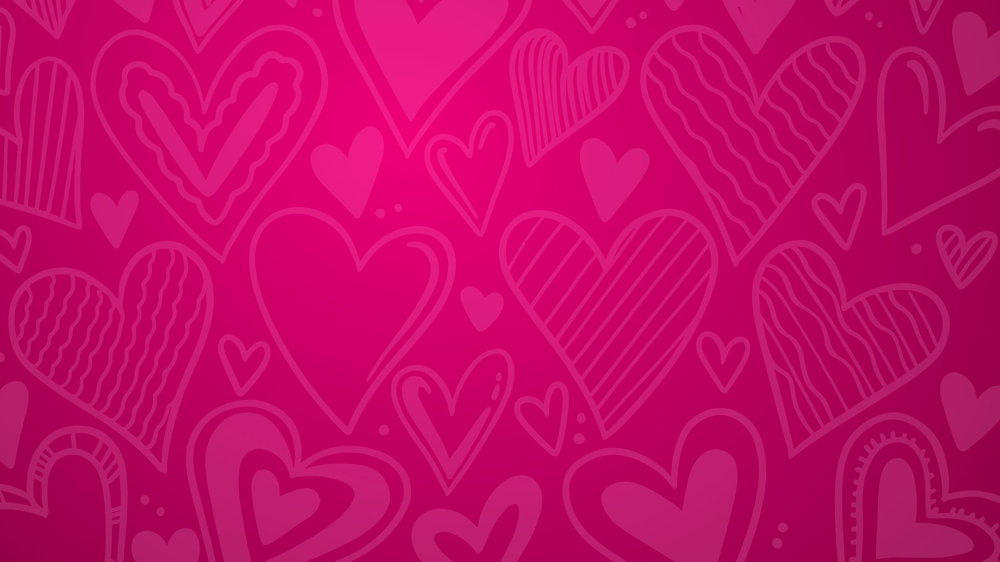

**MENSAJERÍA SECRETA PARA PAREJAS**

* ¿Quiénes son los principales usuarios de producto?
  El producto está pensado para parejas o personas que desean codificar y decodificar mensajes para su persona especial.

* ¿Cuál es el objetivo los usuarios en relación con tu producto?
  Lograr codificar y decodificar mensajes con la finalidad de que nadie pueda entender lo escrito en el texto, solo lo entenderá la persona que tenga la "llave" (número de desplazamiento).

* ¿Cómo crees que el producto que estás creando está resolviendo sus problemas?

Este producto tiene una interfaz fácil e intuitiva, pensada para que los usuarios puedan hacer lo que buscan, en este caso codificar y decodificar un mensaje.

-En el proceso de creación se pensó en una paleta de color acorde al tema a tratar, en este caso mensajería entre parejas. Se agregó un fondo con corazones para generar mayor conexión con la temática y por último se usó un contenedor blanco con un poco de opacidad para que este no compitiera con el fondo.
 

-En todos los recuadros presentes en el producto se hizo uso del border-radius para que estos se vieran agradables a la vista y no generaran esquinas "bruscas" ya que estas imparten fuerza.

-Se pensó en la tipografía 'Oswald', esta pertenece a la familia san serif lo que hace que sea de fácil lecturabilidad y legibilidad ya que no tiene contrastes y sus trazos son uniformes.

  

